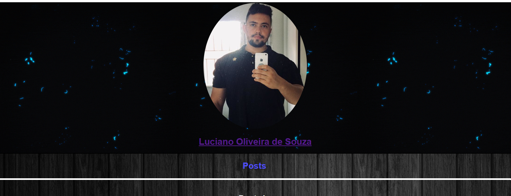
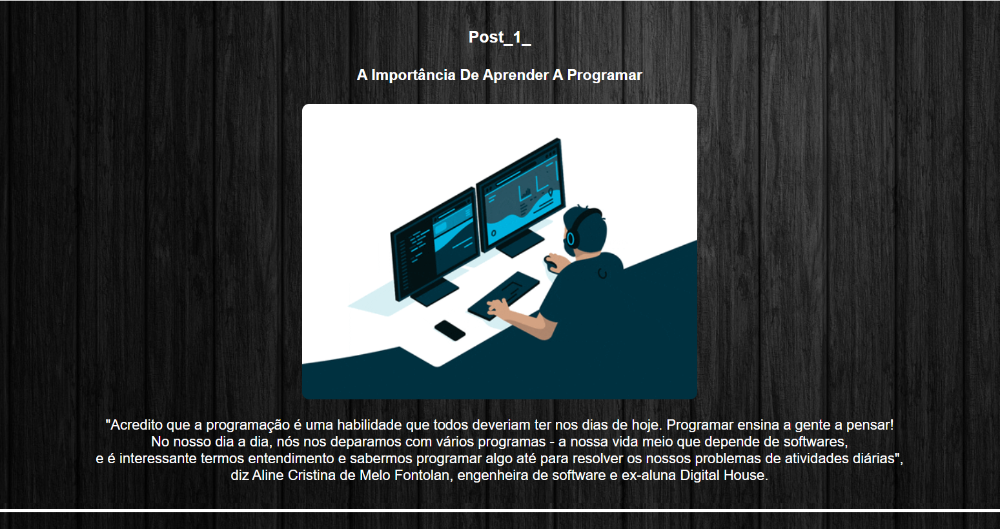

# Criando um Blog
<h5> Projeto da Spread Criando seu Proprio Blog</h5>

Criado um Blog que informa A importância de se aprender a programar

Nesse projeto foi utilizado HTML5 e CSS3.
Com intuito de praticar o que foi aprendido ao decorrer do curso
